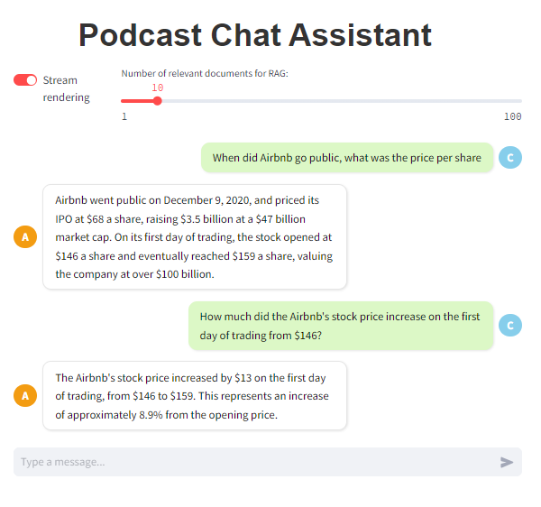

# Podcast Chat with RAG

## Introduction

This is my individual project that I learned RAG and then integrated into LLMs with the combination of retrieving relevant contexts from chat history.

## Install dependencies

Before running the project, please install all pre-requisite packages following this command:

```cmd
pip install -r requirements.txt
```

## Configure Langchain and Groq API

Because of the limitation about the payment issue, I am using free Groq API without any payment requirements. You can replace your api key from other provider services supported by <a href="https://python.langchain.com/v0.2/docs/tutorials/rag/">Langchain</a> based on your decision.

Please visit <a href="https://groq.com/">Groq.com</a> to generate your own API KEY. After acquiring your own api key, you have to create `.env` file at the same directory level of app.py file as follows:

```
GROQ_API_KEY = 'YOUR_API_KEY'
```

If you would like to observe the process of API call from the langchain, please visit <a href="https://www.langchain.com/langsmith">Langsmith</a> and assign these keys into the `.env` file:

```
LANGCHAIN_TRACING_V2 = 'true'
LANGCHAIN_API_KEY = 'YOUR_API_KEY'
LANGCHAIN_PROJECT = 'YOUR_PROJECT_NAME'
```

## Prepare Dataset

The dataset in this project is downloaded from <a href="https://www.kaggle.com/datasets/harrywang/acquired-podcast-transcripts-and-rag-evaluation">Acquired Podcast Transcripts and RAG Evaluation.
</a>

To execute splitting the data into small chunks for vector storage, please navigate to `PATH/TO/ChromaDB/` folder, modify your `PATH/TO/DATASET`, `PATH/TO/VECTOR_DB_STORAGE` and run:

```
python save_chromadb.py
```

## Web-based demo

I have built a web application via <a href="https://streamlit.io/">Streamlit</a> which allows user to interact with the chatbot to ask about the question related to RAG contents as well as retrieving from the chat history.

Make sure that:

- Modify the correct path to your vector storage from the above guidance in <a href="./ChromaDB/create_retriever_chromadb.py">create_retriever_chromadb.py</a> : `db_path = os.path.asbspath("./custom_data/chroma_db")`

#### Execute immediately in local:

To run the website in local, you should be in the correct `PATH/TO/app.py` and the press to your cmd:

```
streamlit run app.py
```

#### Docker Run:

The another option is that you can run the website via Docker.

1. Build the Docker image:

```
docker build -t your-image-name .
```

2. Verify the built image:

```
docker images
```

3. Run the container:

```
docker run -p 8501:8501 --env-file .env your-image-name
```

4. Check if the container is already running:

```
docker ps
```

=>>>> After executing the website by either local or docker, your website is now available at `http://localhost:8501/`



## References

1. Langchain RAG Course: https://blog.futuresmart.ai/series/langchain-rag-course
2. Meta LLAMA 3.1. 70B for RAG - Groq - ChromaDB - Langchain: https://www.youtube.com/watch?v=3ZIjR5eSOv4&t=686s
3. Preprocessing data for RAG: https://afolabi-lagunju.medium.com/the-essential-guide-to-text-preprocessing-for-better-rag-results-c8f9f2ea557c
